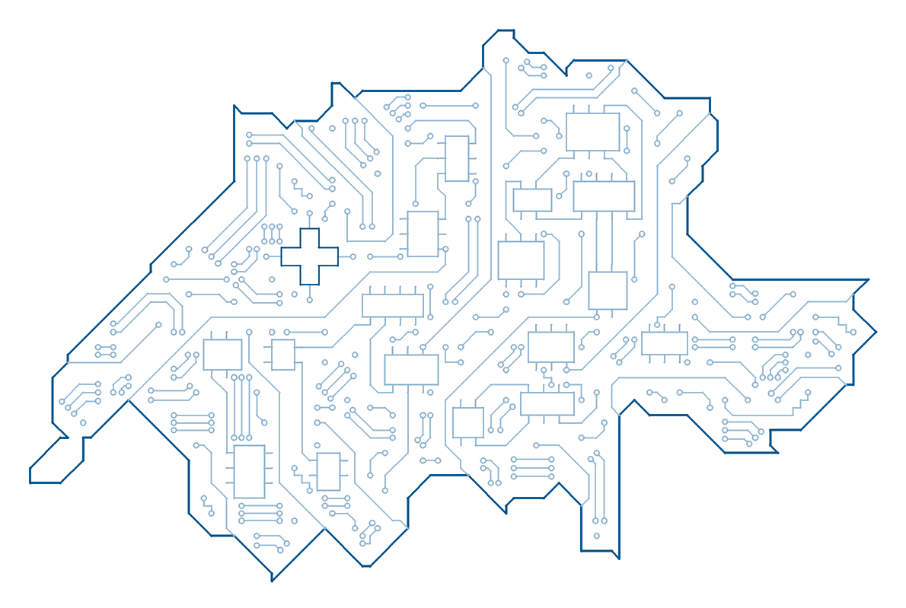

# Swiss TIP - Trusted Information Platform

<p align="center">
  
</p>

An MCP (Model Context Protocol) server that gives an AI assistant grounded
access to authoritative Swiss public information. It serves a curated,
versioned knowledge base in which every fact is tied to an exact excerpt of
an official page, with a citation. The calling assistant composes the answer
itself; the server never invents one, and when a question is not covered it
says so by name.

## The hackathon

Built for the **[Swiss {ai} Weeks](https://zh.ai-weeks.ch/)** hackathon in Zurich, 24 and 25 September
2026, for the challenge **[Swiss Grounding MCP](https://zh.ai-weeks.ch/challenges/swiss-grounding-mcp)**, set by Swisscom's myAI team.

The pitch is at **[swisstip.github.io/swiss-tip/pitch/stage.html](https://swisstip.github.io/swiss-tip/pitch/stage.html)**.

### Evaluation quick start

| # | Criterion | Swiss TIP |
| --- | --- | --- |
| 1 | Commit to evaluate | Branch `main` of both repositories, the code and the knowledge base; the current commits are under [commit to evaluate](#commit-to-evaluate) |
| 2 | Transport | Streamable HTTP, port `8000`, path `/mcp`, stateless, no authentication; `/health` beside it. stdio as well, with `--transport stdio` |
| 3 | Runtime | A prebuilt image, `linux/amd64` and `linux/arm64` under one tag, so it runs natively on Apple silicon ([platforms](docker/README.md#platforms)). Inside: Python 3.14 (`python:3.14-slim`), `swisstip-mcp` 0.3.4 from PyPI, a CPU-only Ollama 0.34.0 with `qwen3-embedding:0.6b`. Nothing but Docker is needed on the host. From source instead: Python 3.14 and uv, see [developer setup](docs/developer-setup.md) |
| 4 | Setup | `docker pull ghcr.io/swisstip/swiss-tip:mvp-zurich` - no prompts, no clone. About 850 MB to download, roughly three minutes; 1.6 GB on disk; 1.2 GiB of memory while running ([measured](docker/README.md#measured)) |
| 5 | Start command | `docker run --rm -p 8000:8000 ghcr.io/swisstip/swiss-tip:mvp-zurich` |
| 6 | Prebuilt data | Shipped inside the image: release `mvp-zurich-2026-09-25-v3` with its semantic index and readiness attestation, and 15 waste-collection calendars, about 15 MB in all, from `releases/mvp-zurich/` and `datasets/mvp-zurich/` of [swiss-tip-mvp](https://github.com/swisstip/swiss-tip-mvp) ([sizes](#credentials-and-the-prebuilt-index)). Refresh: `docker pull` again, since the tag `mvp-zurich` follows the newest attested release, in the time of the download. The semantic index is rebuilt with the command in [developer setup](docs/developer-setup.md#rebuild-the-semantic-index), about 15 minutes on a CPU. The facts themselves are human-reviewed, so a release is not rebuilt automatically |
| 7 | Credentials | None. The server needs no API key, token or account and calls no external service while answering ([credentials](#credentials-and-the-prebuilt-index)). Optional variables, all with working defaults: `PORT` (the port inside the container, default `8000`) and `SWISSTIP_CONNECTORS` (set empty to leave out the calendar and the `lookup` tool) |
| 8 | Hosted endpoint | `https://51-96-83-1.sslip.io/mcp`, no authentication header; `https://51-96-83-1.sslip.io/health`. Up until the evaluation is complete |
| 9 | Declared scope | Topics: residence permits and registration, cantonal migration offices, newcomers, entry and visas, AHV and pensions, social insurance, work and unemployment, tax at source, household taxes, health insurance, naturalisation, political rights, family benefits, housing, driving licences, vehicles and parking, customs, integration, waste, school holidays ([coverage at a glance](#coverage-at-a-glance)). Geography: federal rules for all of Switzerland; arrival registration in all 26 cantons (AG, AI, AR, BE, BL, BS, FR, GE, GL, GR, JU, LU, NE, NW, OW, SG, SH, SO, SZ, TG, TI, UR, VD, VS, ZG, ZH); the full procedures of ZH and the City of Zurich; waste collection in Basel, St. Gallen and Lugano. Languages: questions in German, French, Italian, Romansh or English; answers in the language of the question |
| 10 | One example call | Tool `search`, arguments `{"query": "register arrival City of Zurich", "limit": 3}`: returns the matching concepts, best first - `city-zurich-arrival` with the context it needs (`arrival_origin`) - with `match_strength` `strong` and `retrieval_mode` `hybrid`. The `resolve` that follows, and `curl` commands for both, are in [example calls](docs/example-call.md) |
| 11 | Known limits | [Not covered](#coverage-at-a-glance): fees, appointments and processing times, amounts and calculators, individual eligibility, asylum, social assistance, other cantons beyond arrival registration, other municipalities beyond the waste of Basel, St. Gallen and Lugano. Weak spots: [LIMITATIONS.md](https://github.com/swisstip/swiss-tip-mvp/blob/main/LIMITATIONS.md) |
| 12 | robots.txt and terms of use | `--obey-robots` of the downloader, on by default: it follows `robots.txt` and its crawl delays and fails closed when a policy cannot be read; `--no-obey-robots` overrides it and is recorded in the run. Build time only - the server never fetches a page ([source etiquette](#source-etiquette)) |
| 13 | Parallel use | Yes: stateless, read-only, one worker thread per call; 40 simultaneous calls answered on the hosted instance. `/health` answers 12 to 13 seconds after `docker run`, once the model is loaded ([measured](#evaluating-swiss-tip)) |

#### Commit to evaluate

Swiss TIP is two repositories, both evaluated on their branch `main`:

| Repository | Purpose | Branch | Commit |
| --- | --- | --- | --- |
| [swisstip/swiss-tip](https://github.com/swisstip/swiss-tip) | The MCP server itself: code only, no knowledge base | `main` | [`dee8e12`](https://github.com/swisstip/swiss-tip/commit/dee8e1212c56d77e971cc1d0dcef9f6f7379c3b8) |
| [swisstip/swiss-tip-mvp](https://github.com/swisstip/swiss-tip-mvp) | The MVP knowledge base only: `mvp-zurich`, release `mvp-zurich-2026-09-25-v3` | `main` | [`f17cd5b`](https://github.com/swisstip/swiss-tip-mvp/commit/f17cd5b6754ce9af43f2da7336daefa513e042a5) |

The commit that adds this table to `swiss-tip` comes after `dee8e12` and
changes this README only.

## Quick start

Three ways in, from the simplest to the most involved. Every one of them
speaks Streamable HTTP at `/mcp`, needs no authentication, and has a
`/health` endpoint beside it.

**Hosted for you.** A running instance is hosted on AWS and stays up until
Swisscom's evaluation is complete; connect any MCP client to it, with nothing
to install:

```shell
claude mcp add --transport http swiss-tip https://51-96-83-1.sslip.io/mcp
```

Its `/health` is at `https://51-96-83-1.sslip.io/health`.

Any other client
connects to the same URL: the endpoint speaks Streamable HTTP, is stateless
and needs no authentication. [Connect a client](docs/connect-a-client.md)
has the configuration for Claude Desktop and claude.ai, ChatGPT, Codex,
Gemini CLI, OpenCode, Goose, VS Code, Cursor, Windsurf, Zed, Continue, Open
WebUI, LibreChat, Le Chat, Copilot Studio, n8n, the MCP Inspector and the
Python SDK and agent frameworks, says which of them were tested, and gives a
stdio route for clients that start the server themselves.

The same host runs a demo OpenCode client that is already connected to it.
Open <https://demo.51-96-83-1.sslip.io/> and sign in as `opencode`; the
hackathon team gives out the password on request.

**On your machine, with Docker.** One command and Docker is all you need.
The image carries everything: the MCP server, the `mvp-zurich` knowledge base
with its readiness attestation and semantic index, a CPU-only Ollama with
the `qwen3-embedding:0.6b` model, so search is hybrid (lexical plus
embeddings) from the first request, and the calendar connector with the
pack's 15 waste-collection calendars behind the fourth tool, `lookup`. No
clone, no Python, no API key and no model download.

```shell
docker run --rm -p 8000:8000 ghcr.io/swisstip/swiss-tip:mvp-zurich
```

The first run pulls about 850 MB, roughly three minutes on a normal
connection; the server then answers within about 15 seconds of starting, once
the model is loaded. The image is published for `linux/amd64` and
`linux/arm64`, so an Apple silicon Mac runs it natively, without emulation
([platforms](docker/README.md#platforms)). Check it, and connect your client:

```shell
curl -s http://127.0.0.1:8000/health
claude mcp add --transport http swiss-tip http://127.0.0.1:8000/mcp
```

A healthy `/health` reports `"status": "ok"`, the release ID, the `readiness`
record with status `ready`, `search.configured_mode` set to `hybrid`, and
the calendar connector under `connectors` with its 15 calendars registered;
every `search` result names its own `retrieval_mode` as well. The tag
`mvp-zurich` always serves the newest attested release of that pack; the
packs repository also publishes a tag per release for pinning an exact one.

**The same parts in three containers.** The single image above serves all
five tools, and it is the image the hosted instance runs. The Compose file
of this repository splits the same parts over three containers - the slim
server, the embedding sidecar and the calendar connector - for a host that
wants to run or restart them apart; it is all you need, no clone:

```shell
curl -fsSLO https://raw.githubusercontent.com/swisstip/swiss-tip/main/compose.yaml
SWISSTIP_PACK=mvp-zurich SWISSTIP_CONNECTORS=http://127.0.0.1:8100 docker compose --profile calendar up -d --wait --pull always
```

The endpoint is the same `http://127.0.0.1:8000/mcp`, and `/health` then
lists the calendar connector under `connectors` with its 15 calendars;
`docker compose --profile calendar down` stops it. `--pull always` fetches
the current images even where older ones are cached.

**Other images, or from source.** Other images serve the same release for
narrower cases - a smaller one without the model, a two-container split with
an embedding sidecar, the calendar connector and a browser demo interface;
see [container images](docker/README.md). To run the server from source or
build a knowledge base, see [developer setup](docs/developer-setup.md).

## Evaluating Swiss TIP

**What is evaluated.** The server at `https://51-96-83-1.sslip.io/mcp`,
serving the current release of the `mvp-zurich` knowledge base with hybrid
search and the calendar connector: four tools, `search`, `resolve`,
`get_evidence` and `lookup`. The declared scope is under
[coverage at a glance](#coverage-at-a-glance) and, verbatim, in the server
instructions and in the `scope_statement` and `out_of_scope` of every weak or
empty `search` result.

**A first check.** [Example calls](docs/example-call.md) shows the server
working in two calls: a `search` that finds the concept for a question, and a
`resolve` that returns its human-reviewed fact on registering an arrival in
the City of Zurich, with its citation. Each comes with its tool name, its
arguments as JSON, a `curl` command for the hosted instance and what it
returns.

**Is it the published source?** `/health` names the `release_id`, its
`content_sha256` and the `readiness` attestation. The `content_sha256` equals
`manifest.content_sha256` in
[`releases/mvp-zurich/release.json`](https://github.com/swisstip/swiss-tip-mvp/blob/main/releases/mvp-zurich/release.json)
of the packs repository, and the `docker run` command above starts the same
image on your machine.

**What the tool results say.** The server composes no answer; every result
carries a typed status and a `guidance_for_caller` that tells the assistant
what to do with it:

| Case | What the server returns |
| --- | --- |
| Covered | `resolve`: `SUPPORTED`, with the statements, the review status and one citation per page (URL, publisher, level, access date) |
| A detail the answer depends on is missing | `resolve`: `NEEDS_CONTEXT`, naming the field and its allowed values, for example the state that issued a driving licence for the Zurich exchange procedure; a waste concept offers its calendars with the postal code or collection zone that `lookup` `requires` |
| A federal rule asked for another canton | `resolve`: `SUPPORTED` for the federal rule, with a gap saying that the canton's own procedure is not published (the exchange of a foreign licence asked for Vaud) |
| Outside the declared scope | `search`: `match_strength` `weak` or `none`, with guidance to say that the service does not cover it; `resolve`: `OUT_OF_COVERAGE` with a named gap, such as a City of Zurich procedure asked for Bern, or any country other than Switzerland |
| The snapshot is older than its window | `resolve`: `STALE`, see [freshness](#freshness-and-what-happens-when-it-lapses) |

What is weak or missing is listed in the packs repository's
[LIMITATIONS.md](https://github.com/swisstip/swiss-tip-mvp/blob/main/LIMITATIONS.md).

**Parallel use and start-up time.** Over HTTP the endpoint is stateless: it
keeps no session, so each call stands alone. The release is read-only and
loaded once, and every tool call runs in its own worker thread. Several
conversations can therefore use one server at the same time without sharing
anything. Measured on 2026-09-25 with the `search` and `resolve` calls from
[example calls](docs/example-call.md), all sent at the same moment:

| Where | Calls sent together | All answered | Median | Slowest |
| --- | --- | --- | --- | --- |
| Hosted (AWS t3.small, 2 vCPU), `search` | 1 / 10 / 20 / 40 | yes | 0.2 / 1.7 / 3.1 / 6.0 s | 0.2 / 2.8 / 5.2 / 11.1 s |
| Hosted, `resolve` | 1 / 20 / 40 | yes | 0.5 / 0.3 / 0.4 s | 0.5 / 0.5 / 0.7 s |
| Local `docker run` (20-thread laptop), `search` | 10 / 40 | yes | 0.7 / 1.8 s | 1.1 / 3.1 s |

`resolve` barely slows down. `search` embeds each query on the CPU, so
several searches at once wait in line; the hosted instance handles about
four a second. A conversation makes one call at a time with the model's
reasoning in between, so a few dozen conversations at once stay within these
numbers. For more, give the server more cores or run more copies: they share
nothing, so any load balancer can spread the calls.

Start-up, with the image already pulled: `/health` answers 12 to 13 seconds
after `docker run` and the first search a moment later (two runs, the local
laptop). Almost all of that time goes into loading the embedding model. The
first pull adds the download, about three minutes (see
[quick start](#quick-start)).

## How it works

```text
official page -> saved text -> quoted excerpt -> reviewed fact -> versioned release -> MCP tools
```

A knowledge base ships as one versioned, hashed release bundle. It is built
from curated facts, each citing an exact excerpt of an official page by URL,
access date and hash, and it is served only after its acceptance and
readiness checks pass. Every fact names its review status, and a caller can
ask for reviewed facts only. The server offers three tools: `search`,
`resolve` and `get_evidence`; `get_coverage`, which lists the topics and
concepts, is hidden unless the server is started with `--with-coverage`,
because callers that saw it opened with it instead of searching. `resolve` returns a typed status
that says whether the question is covered, whether a detail such as the
canton is missing, or whether the facts are stale. Where a
[dataset connector](docs/architecture/dataset-connectors.md) is registered,
as on the hosted instance, a fourth tool, `lookup`, returns the rows of an
open dataset a municipality publishes - the next collection dates for a
postal code or a collection zone - with the dataset's publisher, licence and
source hash. The full design is in the
[functional specification](docs/product/functional-specification.md).

## Coverage at a glance

The server is knowledge-base agnostic; the published MVP knowledge base is
**`mvp-zurich`** ([swiss-tip-mvp](https://github.com/swisstip/swiss-tip-mvp)).
The server instructions and every weak or empty `search` result carry the
live scope and out-of-scope list of whatever release is loaded; the snapshot
below describes the current one.

- **Subject:** everyday administrative life in Switzerland, for people who
  live here and people moving here, of any nationality.
- **Jurisdictions:** federal rules and arrival registration for **all 26
  cantons**, the full procedures of the **Canton of Zurich** and the **City of
  Zurich**, waste collection in the **Cities of Basel and St. Gallen** and
  waste hand-over in the **City of Lugano**; federal rules still apply
  elsewhere and are served with a caveat.
- **Topics:** residence permits and registration, cantonal migration offices,
  entry and visas, AHV and the pillar system, tax return and tax at source,
  health and accident insurance, unemployment and the RAV, family allowances,
  naturalisation, voting rights, renting, foreign driving licences,
  vehicles and parking, customs, waste and recycling, integration offers,
  school holidays, and City of Zurich services.
- **Collection dates:** the next collection days from the cities' own open
  data - the City of Zurich by postal code (organic waste, paper, cardboard,
  household waste, the hazardous-waste van), Basel and St. Gallen by
  collection zone - through `lookup` where the calendar connector runs.
- **Languages:** questions may come in German, French, Italian, Romansh or
  English. The search terms are copied from the cited pages: German on
  nearly every concept, English on some, French and Italian on a few. The
  tools tell the calling assistant to search once, in German or English, and
  to translate the key terms of a French, Italian or Romansh question into
  German first; hybrid search (the hosted instance and the images with the
  embedding model) also matches some French and Italian questions directly,
  less reliably. Every municipality is known by its official name, and the
  larger places also by their names in the other national languages (Genf,
  Ginevra, Turitg, Cuira); the answer is written in the language of the
  question. Statements are English
  summaries; excerpts stay in the language of the cited page.
- **Not covered (examples):** fees, appointment availability and processing
  times; benefit amounts, premiums and every calculator; eligibility
  decisions for a specific person; asylum, social assistance and debt
  enforcement; public transport, the commercial register, statistics and
  weather; cantons other than Zurich beyond arrival registration, and
  municipalities other than the City of Zurich beyond the waste of Basel, St.
  Gallen and Lugano; any country other than Switzerland. A weak or empty
  `search` result carries the full list.
- **Sources:** authoritative Swiss publishers only - federal (the offices
  under `admin.ch`, among them SEM, FOPH, FOCBS, FSIO and the Central
  Compensation Office, the law on `fedlex.admin.ch`, `ch.ch` and
  `arbeit.swiss`), bodies with a legal mandate (`ahv-iv.ch`, `svazurich.ch`,
  `serafe.ch`), cantonal (`zh.ch`, and each canton's own site or law
  collection for arrival registration), and municipal (`stadt-zuerich.ch`,
  `bs.ch`, `stadt.sg.ch`, `lugano.ch`, and the open data portals of Zurich,
  Basel and St. Gallen for the calendars); every fact cites an exact excerpt
  with its URL, access date and hash.

**Current release - `mvp-zurich-2026-09-25-v3`:** 21 topics, 238 concepts and
**1,345 facts, all human-reviewed**, cited to 1,615 excerpts across 375 official
documents, and 15 collection calendars. Coverage grows
with each release, so these figures are a snapshot: the running server reports
the live numbers through `/health`, and
[COVERAGE.md](https://github.com/swisstip/swiss-tip-mvp/blob/main/COVERAGE.md)
describes the release in full.

## Source etiquette

Acquisition is operator-triggered and **build-time only**: the MCP server
never crawls at request time, it serves a prebuilt, hashed release. The
downloader respects `robots.txt` and its crawl delays, identifies itself,
stays within a per-host rate limit and a declared budget, and **fails closed**
when a robots policy cannot be read. That is the default; whoever builds the
content can override it per run with `--no-obey-robots`, accepting all the
consequences, and the run records `robots_status: "overridden"` so the
decision is auditable rather than silent. The commands are in
[developer setup](docs/developer-setup.md#source-etiquette).

Quoted official texts kept in a release remain the property of their
publishers and are reproduced only as cited evidence, see [NOTICE](NOTICE).

## Freshness, and what happens when it lapses

Answers come from a **dated snapshot**, never from a live fetch at request
time. For the current release the snapshot date is **25 September 2026**: every
fact says what its official page published on or before that date, and every
citation carries its own `accessed_on` date, so a caller can always tell how
old the evidence is.

The release declares a freshness window of 60 days, which runs out on
**24 November 2026**. The server does not quietly keep serving after that. Once
the window has passed, `resolve` returns the typed status `STALE` instead of
`SUPPORTED`, and says so in its guidance:

> The source snapshot of 2026-09-25 is older than 60 days on 2026-11-24. These
> facts say what the official pages published on 2026-09-25, not what holds on
> 2026-11-24: present them as published on 2026-09-25, do not confirm that
> opening hours, availability, officeholders, rates, contacts or rules still
> apply, and tell the user to check the cited page.

So an assistant is told to present the facts as historical and to send the user
to the source, rather than asserting that they are current. A caller cannot
dodge this by asking for an earlier date: the guidance names that too. The
window is a property of the release, so publishing a fresher release resets it,
and `/health` reports the snapshot date and the date the release goes
stale.

This matters most for the values that move: fees, rates, opening hours,
officeholders and deadlines. Two things keep those honest. Amounts and
calculators are **out of scope** by declaration, not by omission - tariff
tables, tax and pension amounts, premiums and every calculator are listed in
`out_of_scope`, which every weak or empty `search` result carries. And where a rate is published,
the statement carries its own effective date rather than presenting it as
timeless. The mortgage reference interest rate reads:

> The mortgage reference interest rate (Referenzzinssatz) that governs rent
> adjustments is 1.25 percent, valid since 2 September 2025; the Federal Office
> for Housing's page, saved on 18 September 2026, states that it remains
> unchanged from 2 September 2026.

## Credentials and the prebuilt index

**No credentials.** The server needs no API key, no token and no account, at
build time or at run time, and it makes no call to any external service while
answering: it serves a local release, and the embedding model runs locally
inside the image. There is nothing to hand over in order to run or test it,
and the repository holds no secrets.

**The prebuilt index ships with the release.** `semantic-index.json` is part
of a pack's release bundle, so every route above already has it: inside the
image, or downloaded with the release. Nothing has to be embedded, crawled or
fetched by hand before the first request. The index is bound to its release by
the release ID, the release content hash, a hash of every embedded text and
the model's own digest; the server refuses an index built for another release
or another model. The script that builds it is in this repository and the
command is in
[developer setup](docs/developer-setup.md#rebuild-the-semantic-index).

**How big the `mvp-zurich` data is.** Release `mvp-zurich-2026-09-25-v3`,
the one the hosted endpoint serves, holds 21 topics, 238 concepts, 1,345
facts and 1,615 evidence excerpts from 375 source documents. On disk, under
[`releases/mvp-zurich/`](https://github.com/swisstip/swiss-tip-mvp/tree/main/releases/mvp-zurich)
and [`datasets/mvp-zurich/`](https://github.com/swisstip/swiss-tip-mvp/tree/main/datasets/mvp-zurich)
of the packs repository:

| File | What it is | Size (gzipped) |
| --- | --- | --- |
| `release.json` | Facts, excerpts, citations, hashes, place register | 5.8 MB (0.9 MB) |
| `semantic-index.json` | 238 concept vectors, 1,024 dimensions, `qwen3-embedding:0.6b` | 8.2 MB (2.7 MB) |
| `readiness.json` | The attestation that binds the two files above | 3 KB |
| `datasets/mvp-zurich/` | 15 waste-collection calendars for `lookup` | 0.8 MB |

So the data itself is about 15 MB. Of the 850 MB image pull, the rest is the
runtime: Python, the server and the embedding model with its runner.

## What comes next

What we would build next, and why, is in
[next steps and improvements](docs/product/next-steps.md). That covers:
- the knowledge graph tool, which is built and open for review;
- source discovery driven from the admin console rather than agent swarms;
- monetization.

## Repository

| Path | Contents |
| --- | --- |
| `apps/` | `mcp-server`, `quickstart` (the [one command](apps/quickstart/README.md) that fetches and tests a pack), `knowledge-builder`, `admin-console`, `calendar-connector` (the first [dataset connector](apps/calendar-connector/README.md)) |
| `packages/` | `core` (release format, validator, tool contracts), `runtime` (the tool operations, lexical and hybrid search, the connector registry), `ingestion`, `extraction`, `build`, `concepts` |
| `docs/` | [Developer setup](docs/developer-setup.md) (running from source, tests, building a pack), the [functional specification](docs/product/functional-specification.md) and the architecture documents: [release format](docs/architecture/release-format.md), [tool contracts](docs/architecture/tool-contracts.md), [acceptance gate](docs/architecture/acceptance-gate.md), [extraction](docs/architecture/extraction.md), [concept extraction](docs/architecture/concept-extraction.md), [institutions and basis](docs/architecture/institutions-and-provenance-weights.md), [pipeline](docs/architecture/knowledge-base-pipeline.md), [admin console](docs/architecture/admin-console.md), [dataset connectors](docs/architecture/dataset-connectors.md); [connect a client](docs/connect-a-client.md), [example calls](docs/example-call.md) |
| `docker/`, `compose.yaml`, `Dockerfile` | [Container images](docker/README.md): the MCP image, its slim variant without the model, the slim release image, the embedding sidecar and the OpenCode test image; the root Dockerfile builds the server from this source with a pack as build context. The workflow [container-images.yml](.github/workflows/container-images.yml) builds, tests and pushes the images that hold no release; the packs repository builds the ones that hold one |
| `scripts/pypi/` | The PyPI distributions `swisstip-core`, `swisstip-mcp`, `swisstip-quickstart`, `swisstip-calendar-connector` and `swisstip-builder` ([publishing](scripts/pypi/README.md)) |
| `pyproject.toml`, `uv.lock` | The uv workspace of the components, for `uv run` and `uv sync`; each component's own `pyproject.toml` stays the source of its metadata |
| `config/` | Provider profiles of the concepts package |

Running the server from source, the uv workflow, Python 3.14, the unit tests,
building a knowledge base and rebuilding the semantic index are all in
**[developer setup](docs/developer-setup.md)**. Contributor conventions are in
[AGENTS.md](AGENTS.md).

## Licence

Apache License 2.0, see [LICENSE](LICENSE). Quoted official texts in the
knowledge releases remain the property of their publishers and are
reproduced only as cited evidence, see [NOTICE](NOTICE).
