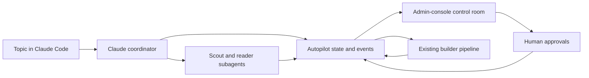

# Automated knowledge-base builder

**Last update:** 23 September 2026

**Status:** Hackathon implementation in progress. The durable workflow kernel,
A1-A6 approval model, hash-bound proposal and promotion path, conservative
fast-track router, source-boundary enforcement, coordinator CLI and browser
control room are implemented and tested offline. Claude Code still authors the
semantic scope, catalogue, curation and suite proposals; no Python generator
replaces those agent roles.

This document describes how Swiss TIP can create a new, well-curated
knowledge base from one high-level topic description while keeping a person
responsible for the important scope, evidence and publication decisions. It
turns the manual agent workflow in the
[worked example](agent-built-knowledge-base-example.md) into a product flow
over the existing [knowledge-base pipeline](../architecture/knowledge-base-pipeline.md).

The intended first input is deliberately small:

```text
Build a Swiss knowledge base about starting as a self-employed sole
proprietor in the Canton of Zurich.
```

The system proposes everything else, explains what it is doing, runs every
mechanical check and pauses at explicit approval gates. The user does not
edit JSON or YAML. A release is never silently reviewed or attested by a
model. The default mode asks a person to review every decision; an optional
fast-track mode delegates a bounded set of low-risk decisions to a configured
frontier model while preserving human control of scope, material evidence,
high-impact facts and publication.

## 1. Product decision

Implement a **governed autopilot coordinator** above the existing knowledge
builder. Do not replace or duplicate the ten-stage builder.

The coordinator owns:

- turning the topic into a proposed scope and user questions;
- discovering and proposing official sources;
- running acquisition and extraction after approval;
- asking models to propose concepts, facts and evidence selections;
- consolidating page-level proposals into a coherent curation;
- generating acceptance and regression cases from the approved questions
  and built facts;
- invoking the existing deterministic stages and interpreting their reports;
- keeping a durable, verbose event log and stopping at approval gates.

The existing packages continue to own:

- bounded downloading and immutable saved responses;
- deterministic text extraction;
- exact evidence spans, hashes and citation anchors;
- curation and acceptance schemas;
- release construction and validation;
- coverage, acceptance and readiness checks;
- human fact confirmation and audit logging;
- offline serving from a release.

The admin console is the human decision surface. The hackathon version uses
Claude Code as the coordinator, reasoning, web-search and subagent runtime,
while a small workflow library owns state, validation and approval records.
This uses the operator's Claude subscription rather than requiring an
Anthropic API key. A later service or another vendor agent can replace Claude
Code without changing the workflow records, pack format or quality gates.

## 2. Why this fits the repositories

Most of the trust-sensitive implementation already exists.

| Capability | Existing owner | Current state |
| --- | --- | --- |
| Ordered, resumable pipeline | [`builder.pipeline`](../../apps/knowledge-builder/src/swisstip/builder/pipeline.py) | Ten stages from `acquire` through `ready`, with a report after every run |
| Pack creation | [`admin_console.screens.packs`](../../apps/admin-console/src/swisstip/admin_console/screens/packs.py) | Creates a validated empty source catalogue |
| Bounded acquisition | [`ingestion.download_cli`](../../packages/ingestion/src/swisstip/ingestion/download_cli.py) | Fetches explicit URLs at depth zero, with host and response limits |
| Deterministic extraction | [`swisstip-extraction`](../../packages/extraction/README.md) | Produces blocks, offsets, hashes and reading views without a model |
| Model proposals | [`swisstip-concepts`](../../packages/concepts/README.md) | Structured extraction, separate review and basis classification, with budgets and checkpoints |
| Safe candidate packaging | [`concepts.package`](../../packages/concepts/src/swisstip/concepts/package.py) | Rechecks exact spans and dry-builds before writing candidates |
| Human fact review | [`admin_console.screens.review`](../../apps/admin-console/src/swisstip/admin_console/screens/review.py) | Confirm, edit, reject and flag; only this path sets `human-reviewed` |
| Audited writes | [`admin_console.writes`](../../apps/admin-console/src/swisstip/admin_console/writes.py) | Records actor, reason and before/after hashes |
| Acceptance gate | [acceptance-gate.md](../architecture/acceptance-gate.md) | Model-free replay and six readiness gates |
| Governed workflow | [autopilot-workflow.md](../architecture/autopilot-workflow.md) | Durable state, verified events, A1-A6 decisions, promotion and checkpoints |
| Claude Code plugin | `swiss-tip-skills` | Governed skill, focused agents, assistant exchange, bootstrap and offline contract tests |
| Workflow control room | [`admin_console.screens.workflow`](../../apps/admin-console/src/swisstip/admin_console/screens/workflow.py) | Verified state, proposals, human decisions, network confirmation, review checkpoint and attestation |
| Pack-agnostic release check | `swiss-tip-mvp/scripts/test/packs/test_committed_packs.py` | Discovers every committed `release.json` |

The orchestration center is now code rather than conversational memory. The
remaining open implementation work is semantic generation quality: Claude
still creates the strict proposals, while the engine validates, binds,
approves and promotes their bytes. Production-scale distributed execution,
automatic exchange response dispatch and broader fast-track classes remain
future work.

## 3. Non-negotiable rules

1. **Evidence is selected, never generated.** A model may select block IDs or
   exact spans from a text record. It may not supply quotation text as source
   evidence.
2. **Only approved URLs are downloaded.** Discovery happens first. The
   bounded downloader receives an exact catalogue only after a person
   approves its authorities, boundaries and request budget.
3. **A machine never marks human work complete.** A model decision is recorded
  as delegated model review, never as human approval. Only an authenticated
  review action sets `human-reviewed`, and only a person supplies
  `attested_by`.
4. **Approvals bind to bytes.** Every approval names the SHA-256 of the
   proposal it approved. Editing the proposal invalidates the approval.
5. **Validation fails closed.** Schema failures, unresolved citations,
   dropped facts, unclassified sections and blocking acceptance failures stop
   the workflow.
6. **Incomplete drafts stay outside the pack.** Agent working files live
   under `.local/<pack>/autopilot/`. Only complete, validated artifacts are
   promoted to `releases/<pack>/`.
7. **Every saved content section is accounted for.** A new autopilot pack
   uses `coverage_policy: enforce`; a section is cited or has a reviewed
   disposition.
8. **Review status is literal.** Every served fact is read against its excerpt
  by a person in both modes. Fast track delegates only typed descriptive source
  metadata and retrieval-only non-blocking query variants in this implementation;
  navigation dispositions remain human-routed. Model delegation and its exact
  applied, omitted or human-review handling remain visible.
9. **Verbosity means an audit trail, not hidden reasoning.** Show inputs,
   assumptions, source-selection reasons, model and prompt identities,
   budgets, candidates, rejections, validation results and pending decisions.
   Do not expose private chain-of-thought.
10. **No publication side effect is implicit.** The coordinator may prepare
    files and commands, but commit, attestation and publication remain named
    human actions.

## 4. User experience

The first screen has one required field, **Topic**, a **Review mode** control
and a **Start build** command. The review mode defaults to **Full review**.
The coordinator derives a pack slug and proposes geography, languages,
questions, source branches and budgets. The person corrects those at the
first gate rather than filling a setup form.


The workflow page shows four things at all times:

- the current state and the next action;
- a timestamped event stream with counts, durations and report links;
- the exact proposal or exception that needs a decision;
- the consequences of approval, including network requests, file writes and
  invalidated downstream work.

Every approval supports **approve**, **request changes** and **reject build**.
Requesting changes returns a structured instruction to the coordinator and
creates a new proposal revision. It never edits an already approved proposal
in place.

### Claude Code and the control room

Claude Code and the browser have deliberately different jobs:



- **Claude Code** plans, searches, delegates, interprets reports and invokes
  workflow commands. Its conversation is not workflow state.
- **Autopilot files** record every proposal, event, model result, approval
  and transition. A fresh Claude session can resume from these files.
- **The admin console** visualizes durable state, displays evidence and
  collects authenticated human decisions.
- **The existing builder** performs deterministic acquisition, extraction,
  release construction and validation.

The control room is a new `/packs/<pack>/workflow` screen in the existing
FastAPI and HTMX console. Reuse its current background-job model and two-second
log polling instead of adding another frontend or WebSocket service.

The screen contains:

1. a phase strip from scope through attestation, with the owner of the next
   decision on every phase;
2. the current operation, completed units, elapsed time and consumed budget;
3. agent jobs with role, status, current document and structured result count;
4. human, frontier-model, deterministic, escalated and rejected decision
   counts;
5. the pending approval card with proposal diff, evidence and consequences;
6. report links and the append-only event stream;
7. a stop action that preserves all completed work.

An illustrative state is:

```text
SELF-EMPLOYED ZURICH                              FAST TRACK

[done Scope] [done Sources] [running Acquire] [pending Curate]
[pending Review] [pending Test] [human Attest]

Current activity       Downloading official pages
Progress               6 of 8 URLs, 5 saved, 1 failed
Current host            www.zh.ch
Elapsed                 00:01:42

Agent jobs              3 complete, 1 running, 0 failed
Decisions               2 human, 7 frontier, 3 deterministic
Escalations             1 waiting for a person
Next action             Review one source exception at A3
```

Do not invent one overall percentage for open-ended model work. Display
progress only where the denominator is known:

| Phase | Progress shown |
| --- | --- |
| Scope | Questions drafted against target; authority branches identified |
| Discovery | Scouts completed; approved questions with at least one source |
| Acquisition | URLs saved of targeted; bytes; failures by class |
| Extraction | Records processed of eligible; blocks; failed records |
| Curation | Candidate documents read; content sections cited, dispositioned and open |
| Review | Human-reviewed, pending, flagged and rejected facts; delegated non-fact decisions |
| Testing | Cases passed of total; blocking failures and quarantines |
| Readiness | Gates passed of six and the blockers for each failed gate |

For a model job with an unknown amount of remaining reasoning, show
`running`, elapsed time, the current work unit and budget consumed. The
event log may contain concise model-supplied summaries, but never hidden
chain-of-thought.

### Review modes

The mode is a workflow policy, recorded in `workflow.json` and confirmed as
part of A1. Changing the mode or its risk rules invalidates every downstream
delegated decision.

| Mode | Human workload | Model authority | Intended use |
| --- | --- | --- | --- |
| `full-review` | Reviews all gates and every fact | Proposes and critiques only | Default, highest assurance and final production review |
| `fast-track` | Reviews scope, source boundary, every served fact, blocking test policy and attestation | May approve explicitly delegable metadata, dispositions and non-blocking variants | Hackathon and rapid first releases with transparent delegated support work |

Fast track is not blanket automatic approval. A deterministic policy routes
each decision before a model sees it. Model confidence alone never makes a
decision delegable.

| Decision class | Full review | Fast track |
| --- | --- | --- |
| Scope, jurisdictions, languages and exclusions | Human | Human |
| Official hosts, path boundaries and network budget | Human | Human |
| ID generation, schema normalization and exact duplicate removal | Deterministic | Deterministic |
| Source metadata within an approved host, aliases and sample-question wording | Human | Frontier reviewer may decide |
| Navigation and exact-duplicate coverage dispositions | Human | Frontier reviewer may decide when deterministic checks agree |
| Facts about eligibility, rights, duties, prohibitions, sanctions, permits, tax or benefits | Human | Human |
| Facts containing a threshold, amount, fee, date, deadline or validity window | Human | Human |
| Jurisdiction or context routing | Human | Human |
| Conflicting sources, model disagreement or extraction and citation warnings | Human | Human |
| Served fact statements, including directory facts | Human | Human |
| Blocking acceptance claims for high-risk facts | Human | Human |
| Noisy query variants and non-blocking regression phrasing | Human | Frontier reviewer may decide |
| Final readiness attestation and publication | Human | Human |

The fast-track frontier reviewer is independent of the proposing call. It
receives the proposal, exact evidence, deterministic validation results and
the delegation policy, but not the proposing model's hidden reasoning. It
must return one of `approve`, `reject` or `escalate` in a strict schema.
Missing evidence, uncertainty, disagreement, a policy match or a malformed
response always means `escalate`.

A delegated approval records:

- the decision class and deterministic risk-rule result;
- the proposal and evidence hashes;
- requested and observed provider and model identity;
- prompt and response-schema hashes;
- decision, concise reason and any cited block IDs;
- token use, elapsed time and cost where the provider reports it;
- the policy version and expiry or invalidation condition.

There is no silent model fallback. A configured frontier profile that is
unavailable, returns another model identity or exceeds its budget pauses the
workflow for a person. Delegated support decisions never change fact review
status. Every served fact must be `human-reviewed` before A5.

## 5. Approval gates

Use `A1` to `A6` for workflow approvals so they are not confused with the
release readiness gates `G1` to `G6`.

### A1 - Scope and questions

The coordinator proposes:

- a short pack name and title;
- country, canton and municipality boundaries;
- evidence and query languages;
- scope statement, explicit exclusions and refusal text;
- planning topics;
- primary user questions, each with its trap, required user facts and a
  provisional expected answer containing `[to verify]` for every rule,
  threshold, amount and deadline;
- decline questions;
- a source and model budget.

The person decides whether this is the right knowledge base to build and
confirms `full-review` or `fast-track` with its exact delegation policy. A1 is
always human. No web content is downloaded before this approval.

### A2 - Source catalogue and network budget

Web-enabled scout agents search by authority branch and return structured
candidates. A deterministic compiler rejects non-HTTPS URLs, unsupported
languages, invalid jurisdictions, duplicate seeds and allowlists that do not
contain their seed.

The review screen groups proposed sources by user question and shows:

- URL, page title and publishing institution;
- federal, cantonal or municipal level;
- why the page is expected to answer a question;
- source kind and expected stability;
- host and path boundary;
- pages, bytes and requests permitted;
- questions with no proposed source.

Approval writes a validated `sources.json` and `sources.md`. A2 is always
human because it authorizes the official-source boundary and a network side
effect. In fast-track mode, the frontier reviewer may have resolved source
metadata and ranking details before the proposal reaches A2, but the person
still sees and approves every host, path boundary and total request budget.
Starting the download remains a separate confirmation.

### A3 - Acquisition and extraction exceptions

After `acquire`, `gaps`, `extract` and `validate-text`, the coordinator
classifies findings but does not hide them. The person approves decisions
for:

- dead or moved pages;
- access denials, robots exclusions and application shells;
- soft error pages served with HTTP 200;
- suspiciously short extractions;
- image-only PDFs with no OCR;
- pages that answer no approved question;
- catalogue changes that require a fresh run directory.

An approved exception uses the existing observation fingerprint pattern of
`review-decisions.json`. A changed observation reopens the decision.

In fast-track mode, exact duplicates, known navigation pages and
deterministically harmless representation choices may be delegated. A gap
that removes evidence for an approved question, changes the catalogue,
widens access or narrows the promised scope always waits for a person.

### A4 - Knowledge design and unresolved ambiguity

The page-level model run proposes concepts, facts, evidence spans and basis
classifications. A consolidation pass proposes the pack-level structure:

- topic and concept IDs;
- duplicate and near-duplicate merges;
- federal, cantonal and municipal variants;
- aliases and bilingual sample questions;
- source terms copied from the selected excerpts;
- institutions and page-basis defaults;
- required context and required user facts;
- contradictions and facts that cannot safely be merged;
- coverage dispositions for uncited sections.

The person approves the structure and explicitly resolves every reported
contradiction or deferral. Approval creates the first valid
`curation.yaml`; it does not mark any fact reviewed.

In fast-track mode, exact duplicate consolidation, unambiguous metadata,
aliases, question wording and low-risk dispositions may be delegated. Every
contradiction, near-duplicate with materially different conditions,
jurisdiction change and deferred in-scope section remains in the human A4
packet. When no human-routed item remains, A4 closes automatically with a
frontier-model decision record rather than a human approval record.

### A5 - Facts and acceptance expectations

In full-review mode, the existing review queue requires every served fact to
be confirmed, edited and confirmed, or rejected. In fast-track mode, the
deterministic risk policy sends every high-risk or uncertain fact to that
queue and permits the independent frontier reviewer to decide only low-risk
facts. The review card keeps statement, context, basis and original excerpt
together, and visibly distinguishes human and delegated decisions.

After the reviewed release is rebuilt, the coordinator replaces provisional
expectations with assertions that the release actually carries and proposes
`acceptance.yaml` and `regression.yaml`. The person reviews the questions,
traps, declines and expected claims. A test may not manufacture a rule that
no reviewed fact states.

In fast-track mode, A5 summarizes generated low-risk variants and asks the
person to approve the blocking test policy, every decline boundary and every
claim tied to a high-risk fact. A frontier reviewer may approve mechanical
or non-blocking query variants. A test that fails is repaired and replayed;
it is never delegated merely because weakening it would make the run green.

### A6 - Final attestation

The workflow presents an attestation packet:

- release ID and content digest;
- source, document, topic, concept, fact and evidence counts;
- review counts and bulk-review counts;
- zero dropped facts and zero unclassified sections;
- acceptance and regression results, including quarantines;
- freshness dates;
- remaining limitations and deferred work;
- the exact files that will be committed or published.

The authenticated person presses **Attest**. A6 is always human. The server passes that actor to
the existing `ready` stage and records the resulting `readiness.json`. The
coordinator cannot call this endpoint with its own identity.

## 6. Workflow state

Add a filesystem-backed state machine under the knowledge-builder. JSON is
sufficient for the single-user hackathon application and follows the
repository's existing run-state pattern.

```text
.local/<pack>/autopilot/
  workflow.json
  events.jsonl
  brief.json
  policy.json
  delegated-decisions.jsonl
  proposals/
    scope/0001.json
    catalogue/0001.json
    knowledge-design/0001.json
    acceptance/0001.json
  approvals/
    scope.json
    catalogue.json
    exceptions.json
    knowledge-design.json
    acceptance.json
    attestation-request.json
  agents/
    <job-id>/request.json
    <job-id>/response.json
    <job-id>/summary.json
  reports/
    contradictions.json
    risk-register.json
    source-coverage.json
    curation-summary.json
    validation-summary.json
```

Suggested states:

```text
drafting_scope
awaiting_scope_approval
discovering_sources
awaiting_catalogue_approval
acquiring
awaiting_exception_approval
extracting
generating_knowledge
awaiting_knowledge_design_approval
awaiting_fact_review
generating_tests
awaiting_acceptance_approval
validating
awaiting_attestation
ready
failed
cancelled
```

`workflow.json` records the workflow schema, ID, pack, original topic,
review mode, delegation profile, current state, revision, model profiles,
budgets, timestamps and hashes of the current inputs and outputs.
`policy.json` contains the immutable risk rules approved at A1, and
`delegated-decisions.jsonl` keeps model decisions separate from human
approvals. `events.jsonl` is append-only. Each event contains:

```json
{
  "at": "2026-09-22T12:00:00Z",
  "kind": "proposal.created",
  "stage": "scope",
  "actor": "coordinator",
  "artifact": "proposals/scope/0001.json",
  "sha256": "...",
  "summary": "Proposed 3 topics, 8 primary questions and 4 declines",
  "metrics": {"model_requests": 1, "prompt_tokens": 4200},
  "next_action": "Human approval A1"
}
```

An approval contains the proposal hash, authenticated actor, timestamp,
decision and note. A transition checks the hash again immediately before it
promotes an artifact or starts a network or model job.

A delegated decision has the same byte binding but an actor type of
`frontier-model` and the requested and observed model identity. It can close
only a decision the policy classified as delegable. An `escalate` result
moves the item into the corresponding human approval packet. States named
`awaiting_*` are entered only when at least one human-routed item remains.

## 7. Agent boundary

There are two implementation modes.

### Claude Code hackathon mode

A repository Claude Code skill is the coordinator entry point. It has the
tools needed for web discovery, subagent fan-out, file inspection and command
execution. Focused subagents isolate the scope-planning, source-scouting,
page-reading, frontier-review and test-authoring contexts. A small
`swisstip-autopilot` library owns the state machine, proposal schemas,
promotion and approval invariants.

The custom agent:

1. receives the high-level topic;
2. runs or delegates structured proposal tasks;
3. submits proposals through `swisstip-autopilot`;
4. asks the person to approve in chat or in the workflow screen;
5. resumes from the recorded state;
6. invokes existing Python APIs and commands;
7. never writes an approval, `human-reviewed` status or attestation itself.

This gives the hackathon a genuine one-prompt experience without first
building a general agent hosting platform.

In fast-track mode, a separate configured frontier-model profile acts as the
delegation reviewer. The coordinator may submit eligible decisions but may
not classify its own output as low risk or alter the routing result. The
state-machine library performs both checks.

For page-level structured extraction, use the existing
`assistant_exchange` profile of `swisstip-concepts`. It writes requests under
the concept job's `exchange/requests/`; Claude subagents return schema-valid
responses under `exchange/responses/`. Re-running the concepts command moves
through extraction, independent review and basis-classification requests,
with the existing checkpoint and identity checks at every pass. This bridge
uses the Claude Code subscription: no Claude API credential is passed to the
Python process or stored in the repositories.

The proposing reader and fast-track reviewer must be separate subagent calls.
Where Claude Code permits model selection, configure the reviewer to the
chosen frontier model and record the observed identity. Where it does not,
the decision remains human-routed rather than silently using the coordinator
as both author and approver.

Suggested repository customization:

```text
.claude/
  skills/build-knowledge-base/SKILL.md
  agents/scope-planner.md
  agents/source-scout.md
  agents/page-reader.md
  agents/frontier-reviewer.md
  agents/test-author.md
```

The skill accepts a new topic or `continue <pack>`. It reads
`workflow.json`, performs only the transition currently allowed, submits all
generated data through the autopilot CLI and stops when a human gate is
pending. A later Claude session resumes with:

```text
/build-knowledge-base continue self-employed-zurich
```

### Product mode

Replace the editor-hosted coordinator with a service adapter. Keep the same
workflow files, schemas and gates. The existing structured-generation
provider protocol can be reused for model calls, but source discovery needs
a separate search/browser capability because the current provider interface
only accepts prompts and JSON response schemas.

Do not couple the deterministic `Pipeline` class to either runtime. It must
remain usable, testable and model-free.

## 8. Generation stages

### Scope generator

Input: the original topic, current date and country defaults.

Output: a strict proposal schema containing scope, exclusions, topics,
languages, user questions, traps, required user facts, decline cases and
budgets. Numeric legal claims are prohibited at this stage unless marked
`[to verify]`.

### Source scouts and catalogue compiler

Run one scout per approved authority branch. Scout output is data, not prose.
The compiler:

- keeps official publishers only;
- normalizes and deduplicates URLs;
- assigns authority, jurisdiction, language and topic hints;
- derives the narrowest safe path allowlist;
- computes the exact download plan;
- reports every question without a source;
- validates through `validate_source_catalog` before presenting A2.

The existing downloader remains depth zero. Discovery does not grant the
crawler permission to wander.

### Page reader

After extraction, run `swisstip-concepts` over every
`curation_candidate`. It already provides:

- deterministic section and chunk selection;
- bounded structured model calls;
- a separate support review;
- basis classification;
- exact span validation;
- checkpoint recovery and model identity recording.

The coordinator should consume these reports instead of implementing a
second evidence-selection path.

### Curation assembler

This is new and is more than the existing candidate packager. It must:

- create the manifest and topic structure;
- translate source-language candidate descriptions into the pack's statement
  language while preserving original evidence separately;
- merge page-level proposals conservatively across records;
- preserve distinct federal, cantonal and municipal procedures;
- generate stable IDs and detect collisions;
- derive institutions from catalogue metadata;
- combine page and citation basis proposals;
- populate aliases, sample questions, user facts and `not_served`;
- copy `source_terms` character for character from selected excerpts;
- report contradictions instead of resolving them silently;
- produce dispositions for sections intentionally omitted;
- validate and dry-build the complete candidate curation before promotion.

Before promotion, the assembler emits `risk-register.json`, one row per fact
and unresolved design choice. The deterministic router gives each row a risk
level, matched rules and required authority: deterministic, frontier model or
human. The frontier reviewer cannot lower that classification.

The assembler must work in memory or against an autopilot draft. The current
`Curation` model requires at least one topic, concept and fact, while the
existing packager requires its target topic to exist. Do not weaken those
production invariants merely to support an empty intermediate file.

### Acceptance generator

Generate tests only after a release builds. Inputs are the approved UAT
proposal and the built release, not model memory.

For every primary case, generate:

- the original question and trap;
- search and resolve steps using published concept IDs;
- expected statuses and named gaps;
- claims using exact phrases copied from the built statements and excerpts;
- answer-quality criteria where a live caller run is planned.

Decline cases assert server behavior, not an uncited alternative answer.
The suite is loaded through the existing Pydantic model and replayed before
it is offered for A5 approval.

The regression generator adds plain, German, noisy, context, date, place and
out-of-scope variants. It must not repeat acceptance questions or quote the
answer in a search query.

### Document generator

Generate `COVERAGE.md`, `LIMITATIONS.md`, the pack README and its row in the
releases README from `release.json` and reports. Do not carry counts forward
from proposals. The generated text is shown in the final diff before A6.

## 9. Implementation ownership

### `swiss-tip`

Implemented under `apps/knowledge-builder/src/swisstip/builder/autopilot/`:

| Module | Responsibility |
| --- | --- |
| `models.py` | Workflow, policy, proposal, approval, checkpoint, promotion and delegation schemas |
| `store.py` | Atomic initialization and transitions, hashes, locks and verified event chain |
| `service.py` | A1-A6 transitions, report checkpoints, promotion, delegation and readiness |
| `cli.py` | Coordinator-safe initialization, status, proposal, promotion, checkpoints, delegation and cancellation |

The package exposes `swisstip-autopilot`. It deliberately exposes no human
approval, fact-review completion or attestation command.

Implemented under `apps/admin-console`:

- `screens/workflow.py` and `views/workflow/` for verified state, proposals,
  review-mode control, events and human actions;
- an attestation endpoint that takes the authenticated actor and invokes
  `Pipeline(..., attested_by=actor)` for `accept..ready`;
- status badges and links from the pack overview;
- audit entries for human decisions and checkpoints.

The console does not invoke a model. Claude Code and the coordinator CLI
remain separate from human identity.

The installable Claude Code skill, focused subagents, assistant-exchange
template and helper scripts live in the sibling `swiss-tip-skills`
repository. This repository does not duplicate them under `.claude/`.

Still planned: Python semantic generators for scope/catalogue/curation/tests,
automatic exchange-response dispatch, broader low-risk metadata delegation,
and a live aggregate network kill-switch.

### `swiss-tip-mvp`

No working proposal is committed. Approved bytes are promoted into normal
pack paths; workflow state remains under ignored `.local/`. Existing checks
discover the resulting `release.json` automatically.

For arbitrary pack publication, make the image workflow accept a free-form
pack input and use dynamic sparse checkout. The current workflow enumerates
`mvp-zurich` and `mvp-wallisellen` and contains Zurich-specific smoke tests.
Keep those specialist tests for their packs, but add one generic release
health, readiness and semantic-search check for every other pack.

## 10. Command surface

The operator starts the existing admin console from the workspace root and
then starts Claude Code in the same workspace:

```powershell
.\.venv\Scripts\python.exe -m swisstip.admin_console.app `
  --packs-dir .\swiss-tip-mvp `
  --actor "Anna Meier"

claude
```

The browser control room is at `http://127.0.0.1:8765`. The Claude plugin
starts a new build when the user asks for the high-level topic.

```text
/build-knowledge-base Starting as a self-employed sole proprietor in Canton Zurich
```

The coordinator uses these stable operations internally:

```shell
# Start from one high-level description.
./.venv/Scripts/python.exe -m swisstip.builder.autopilot.cli init \
  --packs-dir ../swiss-tip-mvp \
  --topic "Starting as a self-employed sole proprietor in Canton Zurich" \
  --review-mode full-review

# Optional fast track. Pin the exact observed reviewer identity; there is no fallback.
./.venv/Scripts/python.exe -m swisstip.builder.autopilot.cli init \
  --packs-dir ../swiss-tip-mvp \
  --topic "Starting as a self-employed sole proprietor in Canton Zurich" \
  --review-mode fast-track --delegation-profile frontier-review \
  --delegation-model "<exact model identity>"

# Inspect the next decision and all work performed so far.
./.venv/Scripts/python.exe -m swisstip.builder.autopilot.cli status \
  --packs-dir ../swiss-tip-mvp --pack self-employed-zurich

# Submit and later promote hash-bound proposal artifacts.
./.venv/Scripts/python.exe -m swisstip.builder.autopilot.cli submit ...
./.venv/Scripts/python.exe -m swisstip.builder.autopilot.cli promote ...
```

In the UI these are **Start**, **Approve**, **Request changes** and
**Continue** actions, with a **Full review / Fast track** control beside the
topic. The CLI exists for Claude, recovery and tests; the person should not
need to type it during the demonstration.

During the demonstration, place Claude Code and the browser side by side.
Claude shows the active collaboration and subagent fan-out; the browser shows
the durable, auditable truth. When the browser records an approval, ask Claude
to continue rather than keeping a model call blocked while it polls:

```text
/build-knowledge-base continue self-employed-zurich
```

The skill, autopilot CLI and cross-stage workflow screen are implemented.
The remaining demo risk is semantic quality and live provider behavior, not
loss of workflow state or an unenforced approval boundary.

## 11. Hackathon slice

Do not attempt the entire self-employment domain live. It spans federal,
cantonal and municipal law, several legal forms, tax, migration and social
insurance, and would make careful human review look implausibly fast.

Use this live topic:

```text
Starting as a self-employed sole proprietor in the Canton of Zurich.
```

Recommended bounds:

| Item | Limit |
| --- | ---: |
| Authority branches | 3 |
| Approved official pages | 5 to 8 |
| Topics | 2 to 3 |
| Concepts | 5 to 8 |
| Facts | 8 to 15 |
| Primary acceptance cases | 5 to 7 |
| Decline cases | 2 to 3 |
| Fact-review time | 10 to 15 minutes |

Prepare one fallback catalogue of known official URLs for stage reliability,
but label its use visibly. A recorded or cached model completion is also an
acceptable fallback when its identity and original request remain in the
workflow log. Never substitute a prebuilt release while presenting the run
as newly generated.

## 12. Demo sequence

1. In Claude Code, invoke `/build-knowledge-base` with the one-sentence topic,
   select **Fast track** in the control room and press **Start build**. Show
   the policy summary of what the frontier reviewer may and may not decide.
2. Show the proposed scope, questions and traps; edit one boundary and
   approve A1.
3. Show scouts finding official pages and the question-to-source matrix;
   reject one weak source and approve A2.
4. Confirm the displayed host and request budget, then run acquisition and
  extraction. Keep Claude Code and the live control room side by side.
5. Show one extraction exception or explain that none occurred; approve A3.
6. Show the agent fan-out over saved pages, exact selected blocks, rejected
   candidates and one cross-page merge; approve the design at A4.
7. Review fact cards side by side with their source excerpts. Show one
  delegated low-risk metadata or regression-variant decision beside the
  human-reviewed facts, and show that it cannot change fact review status.
8. Generate tests, show a failing case causing an automatic repair, then
   approve the corrected expectations at A5.
9. Run the complete build and show zero dropped facts, zero unclassified
   sections and all blocking cases passing.
10. Display the attestation packet, attest as the logged-in person and start
    the server with `--require-ready`.
11. Ask one covered and one deliberately excluded question through the MCP
    client. Show the cited answer and the explicit decline.

The important visual is not the amount of generated text. It is the chain
from one vague idea to a compact release where every machine action is
visible and every consequential judgment has a named person behind it.

## 13. Delivery order

### P0 - convincing end-to-end path

1. Workflow models, full-review and fast-track policies, store, transition
  tests and event log.
2. Custom coordinator agent and scope proposal schema.
3. Source-scout schema, catalogue compiler and A1/A2 approvals.
4. Existing acquire and extract stages wired into the workflow.
5. Concepts job plus complete curation assembler.
6. Workflow screen, deterministic risk register, frontier delegation and
  existing fact-review integration.
7. Acceptance generation, model-free replay and final attestation action.

### P1 - stronger release demonstration

1. Regression generation and lexical replay.
2. Semantic-index job and hybrid replay.
3. Generated coverage and limitations documents.
4. Generic Docker image path for any pack.
5. Recorded live-caller run and grading.

### P2 - production follow-up

1. Standalone coordinator service and web-search adapter.
2. Multi-user durable database and distributed job execution.
3. Provider failover, monetary budgets and cancellation.
4. Strong authentication, TLS and role-separated approvals.
5. Scheduled refresh and change-impact review.
6. Two-person attestation where policy requires it.

## 14. Test strategy

All new package and console tests stay offline.

| Test | Assertion |
| --- | --- |
| State-machine table tests | No gate can be skipped; failed and cancelled runs do not advance |
| Approval hash tests | A changed proposal invalidates its approval |
| Identity tests | Coordinator identities cannot write human approvals or attestations |
| Risk-routing tests | Every high-impact rule is human-only and a model cannot lower the classification |
| Delegation tests | The reviewer is independent, abstention escalates, identity mismatch stops and every decision binds to proposal and evidence hashes |
| Catalogue compiler tests | Only valid official-source structures are promoted; URL boundaries remain narrow |
| Fake-agent fixture tests | Structured proposals survive retries, malformed responses are retained and rejected |
| Curation assembler tests | Duplicate handling is deterministic; contradictions remain visible; every citation dry-builds |
| Coverage tests | Every candidate section is cited or dispositioned under `enforce` |
| Acceptance generator tests | Claims quote the built release, unknown concepts and unsupported rules are refused |
| Resume tests | Restart resumes from persisted state without repeating approved work or paid model calls |
| Console route tests | Only authenticated editors approve; actor and hashes appear in audit records |
| End-to-end synthetic test | One topic fixture reaches `awaiting_attestation` with no network and fake providers |

Keep one recorded real-provider pilot as an experiment under `.local/`, not
as an offline unit test.

## 15. Definition of done

The hackathon implementation is complete when a fresh checkout can show all
of the following:

- one high-level topic is the only initial user input;
- no pack JSON or YAML is manually edited;
- every model and network action is explicit, bounded and recorded;
- the workflow can stop and resume at every approval gate;
- scope, source boundaries, high-risk or escalated facts, blocking test
  policy and final attestation each have a named human decision;
- every served fact is human-reviewed in both modes; fast track records any
  delegated metadata, disposition or non-blocking variant decision separately;
- `build-report.json` contains zero dropped facts;
- `curation-coverage.json` contains zero unclassified sections;
- every blocking acceptance case passes;
- `readiness.json` names the exact release bytes and the human attestor;
- the ready release can be started with `--require-ready` and answers both a
  covered and an out-of-scope demonstration correctly;
- the final screen reports elapsed automation time, human decision time,
  pages, facts, human and delegated decision counts, model calls, token use,
  rejected candidates, escalations and all remaining limitations.

That is the hackathon claim: not that knowledge can be published without a
person, but that the expensive mechanical work and explicitly low-risk
judgments can be delegated while the decisions that establish scope,
evidence trust and publication remain human, explicit and inspectable.
